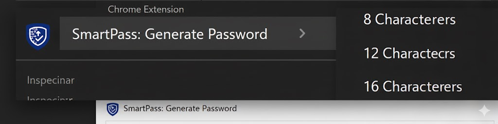
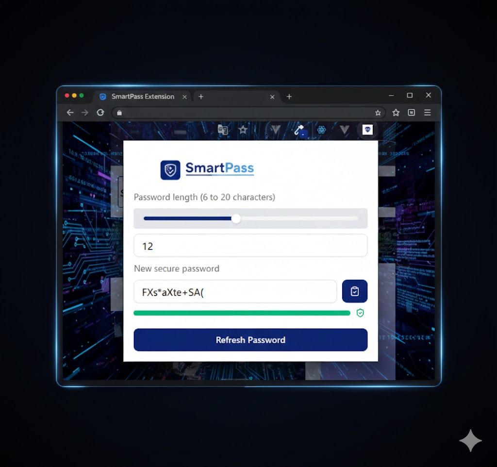

<p align="center">
  
</p>

<h1 align="center">Smart Pass</h1>

<p align="center">
  <strong>Browser extension for generating secure passwords without leaving the page.</strong>
</p>

<p align="center">
  
  
</p>

## 🔗 Links Úteis

* **Extensão Oficial:** [SmartPass na Chrome Web Store](https://chromewebstore.google.com/detail/smartpass/olinbppfnflmmjlccmdlfjjkckhinjnj?hl=pt-BR&utm_source=ext_sidebar)
---

## Overview

Smart Pass integrates a robust password generator directly into your browsing workflow. Create strong, secure passwords instantly during sign-ups — no interruptions, no external tools.

<p align="center">
  
</p>

## Features

### 🔐 Cryptographic Security

Passwords are generated using `window.crypto.getRandomValues()`, ensuring truly random and unpredictable results.

### 📏 Adjustable Length

Use the intuitive slider to customize password length from **6 to 20 characters** based on your security needs.

### 🛡️ Strength Indicator

Visual feedback bar displays password strength in real-time:

- 🔴 **Weak** (≤ 6 characters)
- 🟡 **Medium** (7-8 characters)
- 🟢 **Strong** (9-10 characters)
- 🟢 **Very Strong** (11+ characters)

### 📋 One-Click Copy

Copy your generated password to clipboard instantly with visual confirmation and toast notifications.

### 🔔 Security Notifications

Receive security reminders via browser notifications to ensure safe password usage.

### 🎯 Complete Character Set

Generates passwords using:

- Lowercase letters (a-z)
- Uppercase letters (A-Z)
- Numbers (0-9)
- Special characters (!@#$%^&\*()\_+)

## Tech Stack

- **React 19** + **TypeScript**
- **Tailwind CSS 4** for styling
- **Radix UI** for accessible components
- **React Hook Form** + **Zod** for form validation
- **Vite** for fast development
- **Chrome Extension APIs** for browser integration

## Privacy & Security

| Aspect         | Implementation                                       |
| -------------- | ---------------------------------------------------- |
| **Processing** | 100% local — all passwords generated in your browser |
| **Storage**    | No external servers, no cloud storage                |
| **Encryption** | Uses native `window.crypto` API                      |
| **Privacy**    | Zero data collection or tracking                     |

## Preview

<p align="center">
  
</p>

## Installation

```bash
# Clone the repository
git clone https://github.com/your-username/smart-pass.git

# Install dependencies
npm install

# Run in development mode
npm run dev

# Build for production
npm run build
```

## License

MIT © Smart Pass
